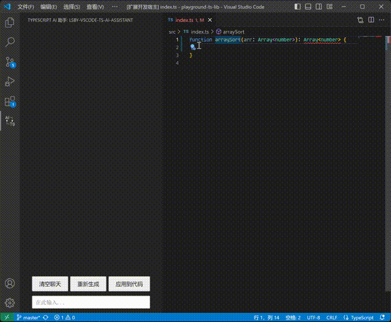

# vscode-ts-ai-assistant

## 链接

- [github仓库](https://github.com/lsby/vscode-ts-ai-assistant)
- [vscode商店](https://marketplace.visualstudio.com/items?itemName=hbybyyang.lsby-vscode-ts-ai-assistant)

## 概述

一个vscode插件, 可以通过函数的类型和说明, 生成AI提示词, 调用AI, 并将AI生成的代码快速应用到代码中.

## 注意事项

- 使用的项目必须安装node的类型: `npm i @types/node`.

## 使用

- 需要先在vscode设置中配置AI服务的地址, apiKey, 模型, 人设等信息.
- 进入插件界面, 可以正常的和AI聊天.
- 焦点在`function`定义的函数上时, 会出现快速修复(小灯泡), 按快捷键或点击小灯泡, 可以看到调用AI相关的选项.
  - "仅生成提示词"将参考当前函数和说明中引用的函数, 递归分析它们引用的函数信息和类型信息, 生成文本填入AI聊天框. 方便用户确认和修改.
  - "调用AI"将在上一步的基础上直接发送给AI, 跳过用户确认的步骤.
- 可以与AI讨论函数的实现, 满意后, 点击"应用到代码", 插件会分析AI最后一条回复中的代码, 将其应用在当前焦点所在的函数上.

## 演示

## 普通聊天

## 生成函数

## 参考函数说明

## 参考类型

## 协议

GPL 3.0 or later
